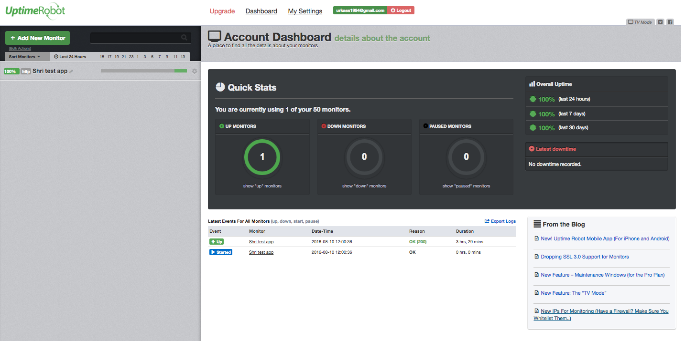
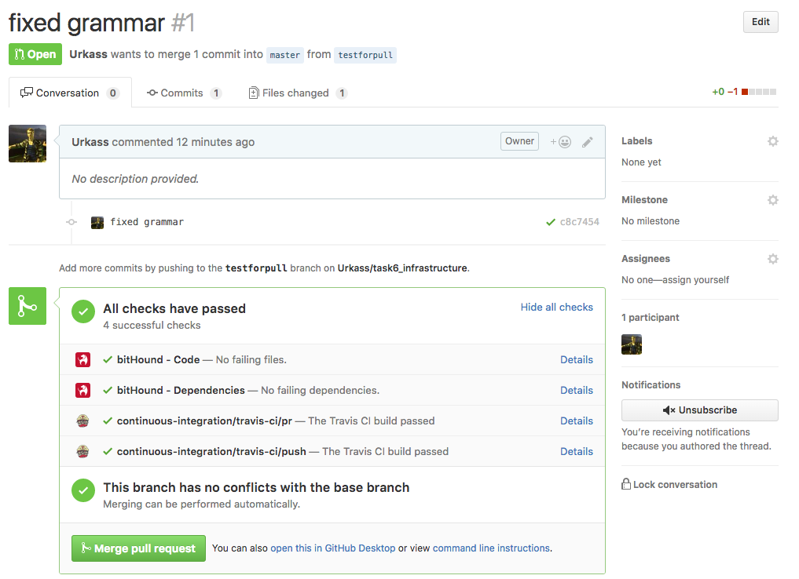

## Домашнее задание по инфраструктуре приложения.
[](https://travis-ci.org/Urkass/task6_infrastructure)
[](https://www.bithound.io/github/Urkass/task6_infrastructure)
[](https://www.bithound.io/github/Urkass/task6_infrastructure/master/dependencies/npm)
[](https://www.bithound.io/github/Urkass/task6_infrastructure/master/dependencies/npm)
[](https://www.bithound.io/github/Urkass/task6_infrastructure)

Реализованы все основные и дополнительные пункты из [задания](https://gist.github.com/andre487/62b51b3e0089e35665849c63fc54acad).

[Приложение на хероку](https://enigmatic-river-85220.herokuapp.com/)

### О приложении

За основу было взято данное нам, как пример, приложение генерации ASCII-рожиц. К нему были добавлены функции генерации выражения и генерации случайного числа для того, чтобы добавить небольшую логику, на которую можно повесить тесты.
В итоге, оно выводит ASCII-рожицу при правильном ответе на простое случайногенерирующиееся выражение. Выводит логи о времени рендера страницы с лицом, сгенерированное выражение с правильным ответом и неправильные ответы пользователей.

### Используемый стэк

* Хостинг: heroku
* Репозиторий: github
* CI: Travis
* Линтинг: eslint . Запуск `npm run lint`
* Облачный линтер http://uptimerobot.com/
* Тесты: Mocha + chai. Запуск `npm test`
* Мониторинг: bitHound

### Логи
#### Heroku
В heroku есть три типа логов:
* системные логи хероку `heroku logs --source heroku`. Например, сообщения о перезапуске процессов, о сне или пробуждении dyno контейнеров или сообщения об ошибках.
* логи api  `heroku logs --source heroku --dyno api`. Сообщения о действия администрирования, например, деплоинге новой версии.
* Логи из запущенного приложения `heroku logs --source app`

Посмотреть все логи можно через ui на сайте heroku или с помощью команды `heroku logs` в консоли. Также можно прокачать вывод и обработку логов хероку с помощью аддонов.

Пример вывода всех логов в консоль с помощью `heroku logs`:
```
2016-08-10T13:22:51.004234+00:00 heroku[web.1]: State changed from up to down
2016-08-10T13:22:51.003673+00:00 heroku[web.1]: Idling
2016-08-10T13:22:53.748280+00:00 heroku[web.1]: Stopping all processes with SIGTERM
2016-08-10T13:22:54.628411+00:00 heroku[web.1]: Process exited with status 143
2016-08-10T13:43:06.381964+00:00 heroku[slug-compiler]: Slug compilation finished
2016-08-10T13:43:06.381958+00:00 heroku[slug-compiler]: Slug compilation started
2016-08-10T13:43:06.178454+00:00 heroku[api]: Deploy afad501 by urkass1994@gmail.com
2016-08-10T13:43:06.178544+00:00 heroku[api]: Release v10 created by urkass1994@gmail.com
2016-08-10T13:43:06.409762+00:00 heroku[web.1]: State changed from down to starting
2016-08-10T13:43:07.658353+00:00 heroku[web.1]: Starting process with command `node server.js`
2016-08-10T13:43:09.922278+00:00 app[web.1]: Cool faces on port 50572
2016-08-10T13:43:11.444742+00:00 heroku[web.1]: State changed from starting to up
2016-08-10T14:08:36.024322+00:00 app[web.1]: Сгенерированное выражение:  30+80 , правильный ответ:  110
2016-08-10T14:08:36.056322+00:00 heroku[router]: at=info method=GET path="/" host=enigmatic-river-85220.herokuapp.com request_id=93330732-1176-443a-9fab-02d870e4ab7a fwd="46.73.237.247" dyno=web.1 connect=1ms service=46ms status=200 bytes=816
2016-08-10T14:08:36.455619+00:00 heroku[router]: at=info method=GET path="/styles.css" host=enigmatic-river-85220.herokuapp.com request_id=b8f814f8-7283-4ea8-8bc0-bbfbe0746e0d fwd="46.73.237.247" dyno=web.1 connect=1ms service=13ms status=200 bytes=348
2016-08-10T14:38:57.807614+00:00 heroku[router]: at=info method=GET path="/" host=enigmatic-river-85220.herokuapp.com request_id=642aaf3a-f2d7-49d6-bbb6-4800a8671d72 fwd="46.73.237.247" dyno=web.1 connect=0ms service=16ms status=200 bytes=816
2016-08-10T14:38:57.800077+00:00 app[web.1]: Сгенерированное выражение:  20-78 , правильный ответ:  -58
2016-08-10T14:38:58.096831+00:00 heroku[router]: at=info method=GET path="/styles.css" host=enigmatic-river-85220.herokuapp.com request_id=d61dc62e-e10f-4208-8c06-8968a7d070e9 fwd="46.73.237.247" dyno=web.1 connect=0ms service=3ms status=304 bytes=236
2016-08-10T14:39:02.120555+00:00 app[web.1]: 20
2016-08-10T14:39:02.126735+00:00 heroku[router]: at=info method=POST path="/answerQuestion" host=enigmatic-river-85220.herokuapp.com request_id=90d6be43-30c8-4ea6-9e53-cb21518a4291 fwd="46.73.237.247" dyno=web.1 connect=2ms service=46ms status=200 bytes=845
2016-08-10T14:39:02.353989+00:00 heroku[router]: at=info method=GET path="/styles.css" host=enigmatic-river-85220.herokuapp.com request_id=f6437b34-980d-4dbf-8066-1957f7258f9a fwd="46.73.237.247" dyno=web.1 connect=0ms service=5ms status=304 bytes=236
2016-08-10T14:39:04.685155+00:00 app[web.1]: Сгенерированное выражение:  89+65 , правильный ответ:  154
2016-08-10T14:39:04.690665+00:00 heroku[router]: at=info method=GET path="/" host=enigmatic-river-85220.herokuapp.com request_id=135ef8f6-e9b1-4015-a980-8cecfb4d153b fwd="46.73.237.247" dyno=web.1 connect=0ms service=2ms status=200 bytes=816
2016-08-10T14:39:04.905731+00:00 heroku[router]: at=info method=GET path="/styles.css" host=enigmatic-river-85220.herokuapp.com request_id=6f91ebbd-9f77-4a3c-92c0-93c8d4219ac3 fwd="46.73.237.247" dyno=web.1 connect=2ms service=2ms status=304 bytes=236
2016-08-10T14:39:07.675372+00:00 app[web.1]: 2
2016-08-10T14:39:07.681243+00:00 heroku[router]: at=info method=POST path="/answerQuestion" host=enigmatic-river-85220.herokuapp.com request_id=8141f5e7-7ca3-44c6-be4b-0555e4ec8c3f fwd="46.73.237.247" dyno=web.1 connect=0ms service=4ms status=200 bytes=845
2016-08-10T14:39:07.874934+00:00 heroku[router]: at=info method=GET path="/styles.css" host=enigmatic-river-85220.herokuapp.com request_id=57eca81f-5eea-4fb8-9569-3601eb5adc5d fwd="46.73.237.247" dyno=web.1 connect=0ms service=2ms status=304 bytes=236
2016-08-10T14:39:10.014764+00:00 app[web.1]: Сгенерированное выражение:  25-25 , правильный ответ:  0
2016-08-10T14:39:10.020780+00:00 heroku[router]: at=info method=GET path="/" host=enigmatic-river-85220.herokuapp.com request_id=e688b360-6e51-416b-9b90-a7ea1150cad6 fwd="46.73.237.247" dyno=web.1 connect=0ms service=4ms status=200 bytes=816
2016-08-10T14:39:10.247327+00:00 heroku[router]: at=info method=GET path="/styles.css" host=enigmatic-river-85220.herokuapp.com request_id=0f3a981f-d190-493b-9f40-39c27e7b724c fwd="46.73.237.247" dyno=web.1 connect=0ms service=2ms status=304 bytes=236
2016-08-10T14:39:14.029202+00:00 app[web.1]: render: 0.696ms
2016-08-10T14:39:14.228325+00:00 heroku[router]: at=info method=GET path="/styles.css" host=enigmatic-river-85220.herokuapp.com request_id=943bb007-88df-4d6d-9271-7706dcd61883 fwd="46.73.237.247" dyno=web.1 connect=0ms service=2ms status=304 bytes=236
2016-08-10T14:39:14.033530+00:00 heroku[router]: at=info method=POST path="/answerQuestion" host=enigmatic-river-85220.herokuapp.com request_id=a31d9bb0-600b-4eff-b864-2a6eb8fb98b3 fwd="46.73.237.247" dyno=web.1 connect=1ms service=3ms status=200 bytes=871
```
#### Uptimerobot

Данный сервис следит за состоянием приложения и при падении сервера уведомит меня об этом по почте. Он тоже хранит в себе логи, но с гораздо меньшим количеством информации (только о состоянии сервера в определенные моменты времени) и предоставляет возможности для их экспорта. Позволяет установить несколько мониторов, которые могут заниматься поиском ключевого слова в ответе, пиногованием, ответом определнного порта и определенного http. Информацию он визуализирует в графическом представлении. Мною был поставлен интервал проверок в 6 часов, так как бесплатный тарифный план Heroku ограничивает время аптайма приложений.
```
Up,"2016-08-10 12:00:38",OK,"2 hrs, 51 mins"
Started,"2016-08-10 12:00:36",OK,"0 hrs, 0 mins"
```

### Pull request
Был сделан тестовый пул реквест и успешно смержен с основной веткой после одобрения его трэвисом.

Также был сделан тестовый коммит с невалидным кодом, которые трэвис успешно не дал задеплоить.


